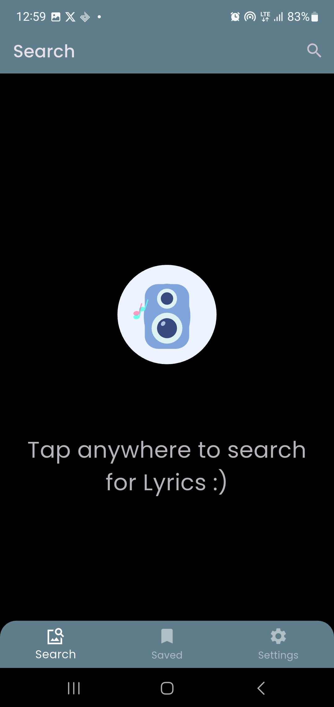
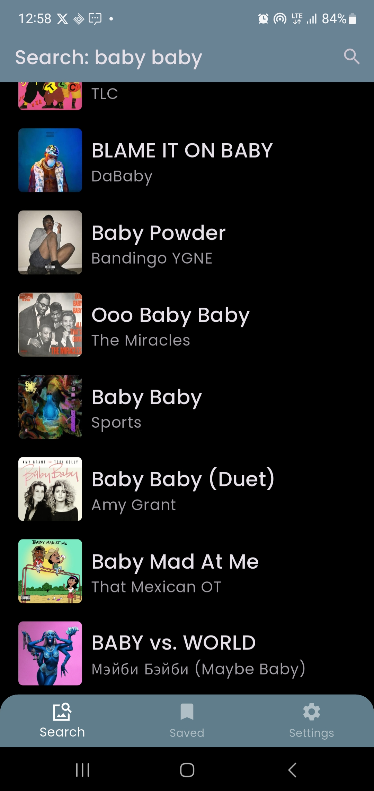
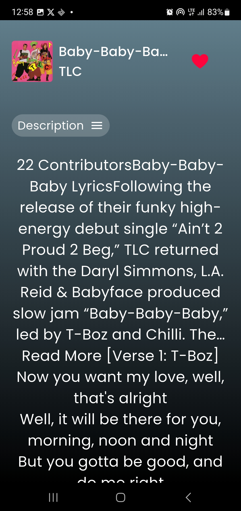
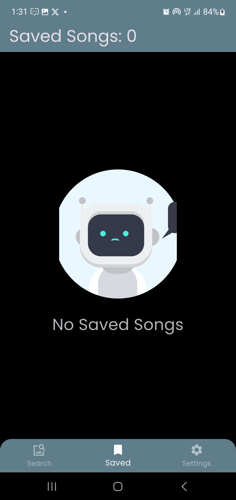

# Music-Lyrics-Appl

## 🎵 Music Lyrics Finder

Description:
A sleek Flutter app that allows users to search for any song and instantly retrieve its lyrics along with a short song description. The app focuses on simplicity and speed — just type in the song title or artist name, and get the lyrics displayed in a clean, readable format.

## Screenshots

  
   
    
    
   

## Features:
🔍 Search for songs by title or artist

📝 View complete song lyrics

🎧 See brief song descriptions or metadata (artist, album, release year)

⚡ Lightweight and fast UI

📱 Responsive and minimal Material 3 design
